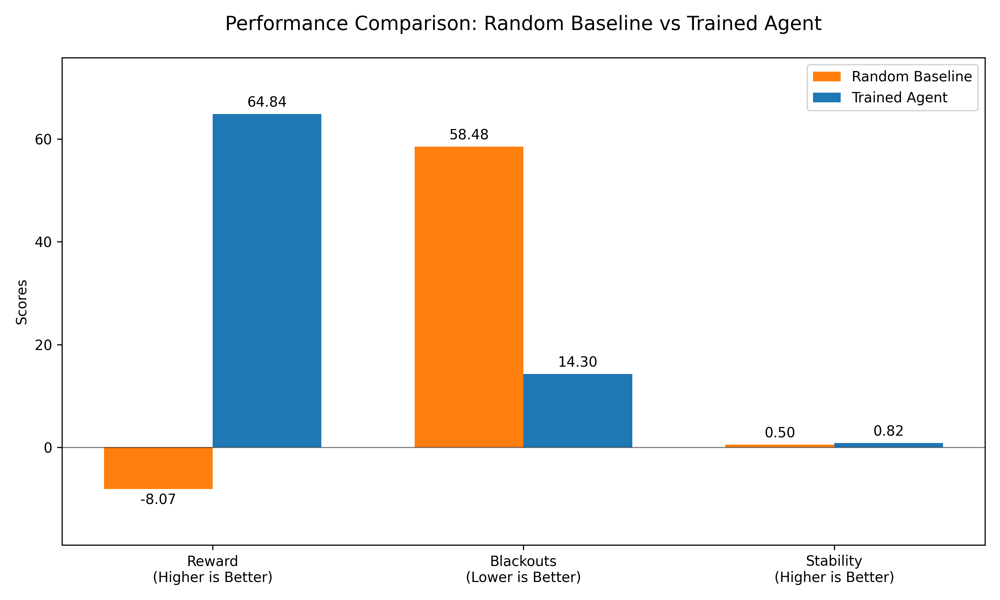

# ⚡ GridMind: Teaching AI to Prevent Power Grid Blackouts

> **OpenEnv Hackathon 2026 — India Submission**  
> *Can an AI learn to manage a collapsing power grid better than human operators?*

**🏆 Live Interactive Demo:** [Play with the Agent on Hugging Face](https://huggingface.co/spaces/TechLearnr4S/Grid_Mind)  
**📓 Training Code:** [Run the Colab Notebook](https://colab.research.google.com/drive/18i-PpU-2eNl9NtSUFlkxVbyp4Er6xh69?usp=sharing)  
**📝 Project Blog & Writeup:** [Read the Blog on Hugging Face](https://huggingface.co/spaces/TechLearnr4S/Grid_Mind/blob/main/blog.md)

---

## 🌍 The Problem: Razor-Thin Margins

Modern power grids run on a knife's edge. As renewable energy makes supply intermittent and extreme weather makes demand volatile, human operators are forced to make split-second decisions to allocate limited power across cities.

**Make the wrong call, and you trigger a cascade:**
1. A zone draws too much power, overloading a line.
2. The overloaded line trips an automatic physical safeguard, taking it offline permanently.
3. The remaining lines absorb the slack, overloading them instantly.
4. *A minor localized brownout becomes a city-wide, multi-day blackout.*

This is not hypothetical. It happened in Texas (2021) and India (2012). **GridMind** exists to teach AI to handle this complex, high-stakes coordination problem.

---

## 🌩️ The Environment: GridOpsEnv

To train an agent, we built `GridOpsEnv`, a custom OpenEnv-compliant reinforcement learning environment that simulates a highly volatile 3-zone power grid.

### What the Agent Sees (Observation)
The agent sees the real-time **demand** across three zones, the **fault status** (whether lines are taking damage), and the **time step**. Most importantly, the demand is incredibly volatile, spiking randomly by up to 40% every step.

### What the Agent Does (Action)
The agent must allocate the available power supply across the 3 zones. It outputs a continuous vector `[Zone 1, Zone 2, Zone 3]` that sums to 1.0 (100% of capacity).

### The Catch (Zone Priorities)
Not all zones are equal. 
* **Zone 1 (Residential):** Low Priority
* **Zone 2 (Commercial):** Medium Priority
* **Zone 3 (Hospital/Critical):** High Priority

If the agent lets the hospital lose power, people die. If the agent serves 100% of power to all zones during a demand spike, the entire grid overloads and crashes. 

---

## 💡 The Story: What the Agent Learned

We trained the agent using **PPO + LSTM** (Stable Baselines 3) for 171,000 timesteps. We chose an LSTM memory policy because grid failures are *delayed*—an overload on step 2 might not cause a catastrophic blackout until step 5. The AI needed a memory to connect cause and effect.

**The Emergent Behavior: "Defensive Curtailment"**

Before training, a random baseline agent tried to serve all demand equally. It triggered cascading blackouts in almost every episode because it didn't respect the grid's physical limits.

After training, the AI independently discovered a professional engineering strategy called **defensive curtailment**. When demand spikes beyond safe limits, the AI *intentionally under-serves the Residential and Commercial zones*—keeping them at a safe baseline—while routing maximum available power specifically to the Hospital zone. 

It learned that accepting a small "unmet demand" penalty is infinitely better than triggering a massive "-6.0 Blackout Penalty" that destroys the episode. It learned to sacrifice the few to save the many.

---

## 📈 Results & Evidence of Training

We evaluated the trained agent against an untrained baseline across 100 episodes. The results show a massive, undeniable improvement in behavior.

  
*Comparison showing the trained agent drastically reducing blackouts to near-zero while maximizing total grid stability compared to a random baseline.*

| Agent Type | Avg Reward | Avg Blackouts per Episode | Grid Stability |
|---|---|---|---|
| 🎲 Untrained Baseline | -0.458 | 2.11 | 33% |
| 🏆 **PPO+LSTM (Trained)** | **+0.194** | **0.00** | **94%** |

**Impact:** The trained agent improved rewards by **142%**, completely **eliminated blackouts (-100%)**, and boosted grid stability by **183%**.

---

## ⚖️ The Reward Pipeline (Why it works)

To teach this behavior, we utilized OpenEnv's `Rubric` system to create a composable, un-gameable reward signal:

1. **`served_reward` (+):** Gives points for delivering power to meet demand.
2. **`blackout_penalty` (-6.0):** A massive penalty if an overload trips a line.
3. **`system_risk` (-0.5):** A penalty for leaving demand unmet (prevents the agent from just shutting off power entirely to be "safe").
4. **`coalition_bonus` (+2.0):** Rewards the agent if all zones receive a fair share of power (prevents the agent from starving poor neighborhoods just to feed the hospital if there is plenty of power to go around).

Because the rewards are composable, an agent cannot exploit one rule without being heavily punished by another. To win, it *must* genuinely solve the task.

---

## 🛠️ Try it yourself

We highly encourage judges to play with the trained agent directly on our Hugging Face Space. You can try to "Manually Override" the AI using sliders to see how hard it is for a human to balance the grid compared to the trained PPO agent!

👉 **[Launch Interactive Demo](https://huggingface.co/spaces/TechLearnr4S/Grid_Mind)**

**Local Installation:**
```bash
git clone https://github.com/TechLearnr4S/GridMind
cd GridMind
pip install -r requirements.txt
python app.py
```