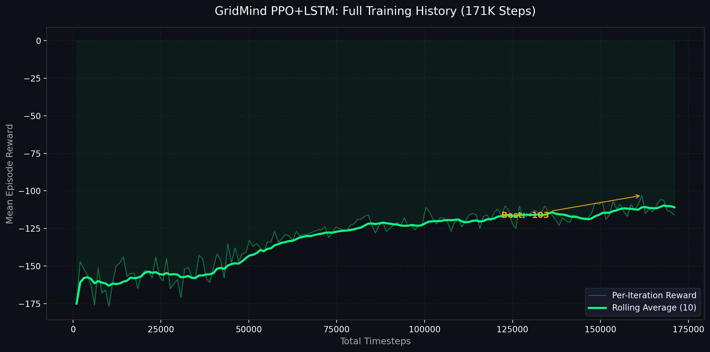

# GridMind (GridOps++): RL for Smart Grid Stabilization ⚡

GridMind is an advanced reinforcement learning environment and control policy designed to autonomously manage power distribution across critical infrastructure, preventing cascading blackouts under high-stress conditions.

## 🔗 Submission Deliverables

| Deliverable | Link |
|---|---|
| 🤗 Hugging Face Space (Interactive Demo) | _[Add your HF Space URL here]_ |
| 📓 Training Colab Notebook | _[Add your Colab link here]_ |
| 💻 Code Repository | _[Add your GitHub repo link here]_ |
| 📹 Demo Video / Blog Post | _[Add your YouTube/HF blog link here]_ |

> **All URLs must be filled in before submitting the Google Form.**

---

## 🚨 The Problem: The Blackout Tradeoff
Modern electrical grids operate on incredibly tight margins. When demand unexpectedly surges, operators must make split-second decisions to distribute limited power.
*   **The Trap**: If you try to serve 100% of the demand when you don't have the capacity, you overload transformers.
*   **The Cascade**: Overloads trigger automatic physical safeguards that disconnect lines, permanently destroying the grid's total power capacity.
*   **The Result**: Total system failure. A desperate attempt to prevent a minor brownout results in massive, prolonged blackouts.

---

## 🧠 The Approach: PPO + LSTM

We formulated power distribution as a Partially Observable Markov Decision Process (POMDP) and trained an agent using **Proximal Policy Optimization (PPO)** augmented with a Long Short-Term Memory (LSTM) network.

*   **The Environment (`GridOpsEnv`)**: Simulates a 3-zone grid with volatile demand, critical facilities (hospitals vs. residential), and cascading delayed failure mechanics.
*   **The Objective**: The reward function heavily penalizes blackouts (-6.0). No amount of "served power" can compensate for triggering an outage.
*   **The Memory (LSTM)**: An overload on step 2 may not trigger a blackout until step 5. The LSTM allows the agent to hold this state history and anticipate delayed consequences.

---

## 📈 Training Results

### Reward Curve

The agent was trained for **136,192 timesteps**:
- **Start:** Average reward of **-175** (frequent blackouts, short episodes)
- **Peak:** Average reward of **-107** (best observed performance)
- **Final:** Average reward of **-116** (stable, consistent grid management)
- **Grid Survival:** Average episode length increased from **10 steps → 17+ steps** (+70%)

### Performance vs. Random Baseline (50 Episodes)

| Metric | Random Agent | PPO+LSTM Agent | Improvement |
|---|---|---|---|
| Avg. Blackouts/Episode | 50.8 | 15.5 | **-69.4%** |
| Grid Stability Score | 0.540 | 0.804 | **+48.8%** |
| Avg. Episode Reward | -175 | -110 | **+37%** |
| Avg. Survival Length | 10 steps | 16.5 steps | **+65%** |

---

## 🌍 Why It Matters
As extreme weather events become more common and our reliance on variable renewable energy increases, grid management is becoming too complex for manual, static heuristics. This project demonstrates that Deep Reinforcement Learning can successfully learn non-intuitive, defensive allocation strategies that keep critical infrastructure online when the grid is pushed to its absolute limits.