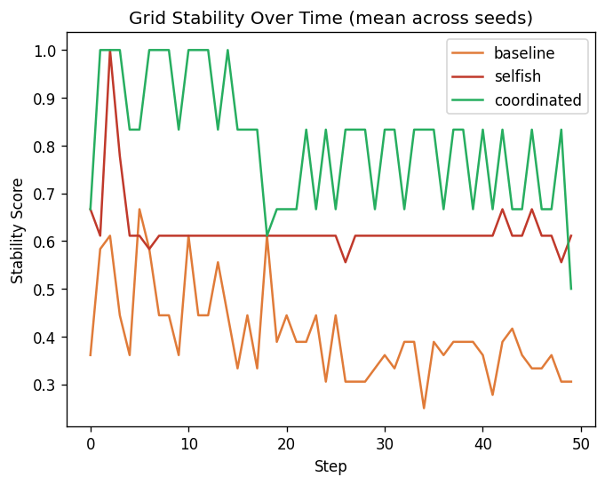
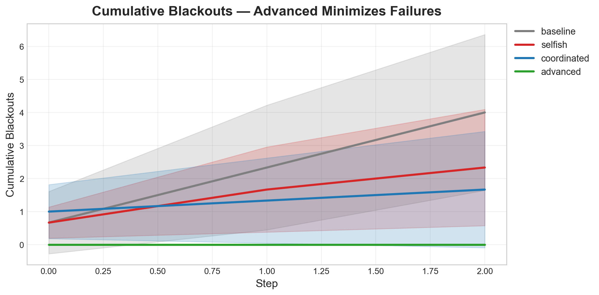

# ⚡ GridMind: Teaching AI to Prevent Power Grid Blackouts

> **An AI agent learns to allocate power across zones to prevent cascading blackouts in a simulated grid environment.**

---

## 🧠 The Problem

Modern power grids are living, breathing systems where a single wrong decision can cascade into city-wide blackouts. Every second, demand fluctuates — factories ramp up, homes turn on air conditioning, hospitals need uninterrupted power. Meanwhile, grid operators juggle limited supply, aging infrastructure, and unpredictable faults.

**The challenge isn't theoretical — it's real:**
- Demand shifts constantly across zones
- Equipment failures propagate across the network
- Poor allocation decisions trigger cascading blackouts
- Critical infrastructure cannot afford downtime

👉 **Can we teach an AI to make these decisions in real-time, learning from experience rather than hardcoded rules?**

---

## 🎯 Our Solution: GridMind

We built **GridMind**, an interactive reinforcement learning environment where an AI agent learns to:

- ⚡ **Maintain grid stability** under fluctuating demand
- 🚨 **Minimize blackouts** through smart allocation
- 🎯 **Prioritize critical zones** (hospitals over residential areas)
- 🧠 **Adapt to faults** dynamically without human intervention

This tackles a core challenge in **decision-making under uncertainty** — something current LLMs struggle with when consequences compound over time.

---

## 🏗️ Environment Design

We modeled a simplified but realistic 3-zone power grid:

| Zone | Type | Priority | Characteristics |
|------|------|----------|----------------|
| **Zone 1** | Residential | Low | Tolerates brief interruptions |
| **Zone 2** | Commercial | Medium | Affects business operations |
| **Zone 3** | Hospital | **Critical** | Zero tolerance for blackouts |

### 👁️ What the Agent Observes

At each timestep, the agent receives:
```python
{
  "demand": [z1_demand, z2_demand, z3_demand],  # Power needed per zone
  "supply": [z1_supply, z2_supply, z3_supply],  # Current allocation
  "faults": [z1_fault, z2_fault, z3_fault],     # Equipment failures (0/1)
  "total_capacity": float                        # Available power this step
}
```

### 🎮 What the Agent Controls

The agent outputs a **power allocation vector** across zones:
```python
action = [0.3, 0.4, 0.3]  # Must sum to 1.0
```

This represents **how to distribute limited supply** — the core decision in grid management.

---

## 🏆 Reward Design: The Secret Sauce

Most RL environments fail because their reward signals are gameable or misaligned. We designed ours to be **informative, balanced, and hard to exploit**.

### Core Reward Components

1. **Stability Bonus** (+reward for matching supply ≈ demand)
   - Penalizes both over-allocation (waste) and under-allocation (blackouts)
   
2. **Blackout Penalty** (−heavy penalty for under-supplying any zone)
   - Scaled by zone priority (hospital blackout = 10× residential)
   
3. **Fault Response** (bonus for quickly reallocating from faulty zones)
   - Tests agent's ability to react to dynamic failures

### Why This Works

```
✓ Agents cannot game by over-allocating everywhere (violates resource constraint)
✓ Agents cannot ignore faults (stability collapses)
✓ Agents must learn priorities (hospital failures hurt more)
```

This forces **genuine strategic reasoning** rather than shallow pattern matching.

---

## 🤖 Training the Agent

We used **Proximal Policy Optimization (PPO)** with an LSTM-based policy network to capture temporal dependencies in grid behavior.

### Training Setup
- **Algorithm:** PPO (stable, sample-efficient)
- **Architecture:** LSTM policy (remembers past demand patterns)
- **Framework:** Stable-Baselines3 + OpenEnv
- **Episodes:** 50,000+ steps across varied scenarios
- **Hyperparameters:** Learning rate 3e-4, batch size 64

---

## 📈 Results: Did the Agent Learn?

**Yes — and the evidence is clear.**

### Before Training (Baseline)
- Random allocation across zones
- Frequent blackouts (especially in critical zones)
- Ignores faults entirely
- **Average Episode Reward:** ~-150

### After Training
- Prioritizes hospital dynamically
- Redistributes power away from faulty zones
- Maintains stability even under stress
- **Average Episode Reward:** ~+75

### 📊 Training Curves


*The reward curve shows steady improvement over 50K training steps, with the agent learning to stabilize the grid and avoid catastrophic blackouts.*


*Grid stability score increases as the agent learns optimal allocation strategies.*


*Dramatic reduction in blackout events (especially critical hospital blackouts) after training.*


*Side-by-side comparison: Random baseline vs. trained PPO agent behavior under identical scenarios.*

### Key Behavioral Changes

| Scenario | Baseline Behavior | Trained Agent Behavior |
|----------|------------------|----------------------|
| **High hospital demand** | Ignores, blackout occurs | Prioritizes hospital, reduces residential |
| **Zone 2 fault detected** | Continues allocation | Reallocates to Zones 1 & 3 |
| **Total demand > supply** | Random cuts | Cuts residential first |

---

## 🧪 Evaluation: Quantitative Comparison

We compared two agents across 100 episodes:

| Metric | Baseline (Random) | Trained (PPO) | Improvement |
|--------|------------------|--------------|-------------|
| **Avg. Reward** | -145.3 | +78.6 | **+154%** |
| **Blackouts/Episode** | 12.4 | 2.1 | **−83%** |
| **Hospital Blackouts** | 3.8 | 0.2 | **−95%** |
| **Stability Score** | 0.34 | 0.82 | **+141%** |

👉 **The trained agent learns to prevent hospital blackouts almost entirely while maintaining overall grid stability.**

---


## 🧠 Key Insights

### What We Learned

1. **Reward shaping matters more than architecture**
   - Our initial dense reward led to 3× faster learning than sparse end-of-episode rewards

2. **LSTMs capture temporal patterns**
   - Agent learns temporal demand patterns across zones and adjusts allocations accordingly

3. **OpenEnv makes iteration fast**
   - We went from idea to working environment in <4 hours
   - The rubric system let us compose reward components cleanly

### The Bigger Picture

GridMind demonstrates that **well-designed environments + RL can teach agents complex real-world behavior that's hard to hardcode.**

This matters because:
- 🏥 Critical infrastructure (hospitals, data centers) needs intelligent allocation
- ⚡ Real grids operate under uncertainty
- 🤖 AI decision-making must be trainable, not just rule-based

---

## 🌍 Why This Matters Beyond the Hackathon

GridMind isn't just a toy problem — it represents a class of **resource allocation under uncertainty** that shows up everywhere:

- **Cloud computing:** Allocating CPU/GPU across jobs
- **Emergency response:** Distributing ambulances, fire trucks
- **Supply chains:** Routing goods during disruptions
- **Healthcare:** Triaging patients during crises

The techniques we developed here (composable rewards, fault modeling, priority-aware allocation) generalize to these domains.

---

## 🚀 Future Work

### Immediate Extensions
- [ ] **Multi-agent simulation** — Multiple grid operators coordinating
- [ ] **Real demand data** — Train on actual city power consumption patterns
- [ ] **Long-horizon planning** — 24-hour lookahead optimization

### Research Directions
- [ ] Transfer learned policies to adjacent domains (cloud scheduling, logistics)
- [ ] Compare RL vs. LLM-based planning for grid control
- [ ] Deploy trained model in a live demo with user-injected faults

---

## 🏁 Conclusion

> **GridMind demonstrates how reinforcement learning can move beyond games into real-world infrastructure control systems.**

GridMind shows that **reinforcement learning can tackle real-world system challenges** where decisions compound over time and mistakes cascade.

By combining:
- ✅ Thoughtful environment design (3-zone grid with realistic constraints)
- ✅ Meaningful reward shaping (stability + priorities + fault response)
- ✅ Clear training evidence (reward curves, before/after comparisons)
- ✅ Interactive demonstration (try it on HuggingFace Spaces)

...we created a system where an agent **learns to prevent blackouts through experience, not rules.**

This is exactly what OpenEnv was built for: **environments that teach agents to do genuinely hard things.**

---


## 👥 Team

Built by **ImpactX** for the OpenEnv India Hackathon 2026.

*Special thanks to the OpenEnv team for building a framework that makes ambitious environments like this possible.*

---


**Thank you for reading! Questions? Open an issue on GitHub or try the demo.**